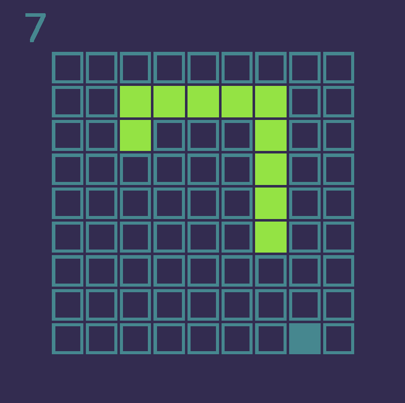

# hake

**Snake implemented in Haskell with Gloss and ALUT**

Recommended to compile using Stack.

You will also need your OS / distribution's version of FreeALUT which should be available pre-compiled.

On OSX you can get it with `brew`.
